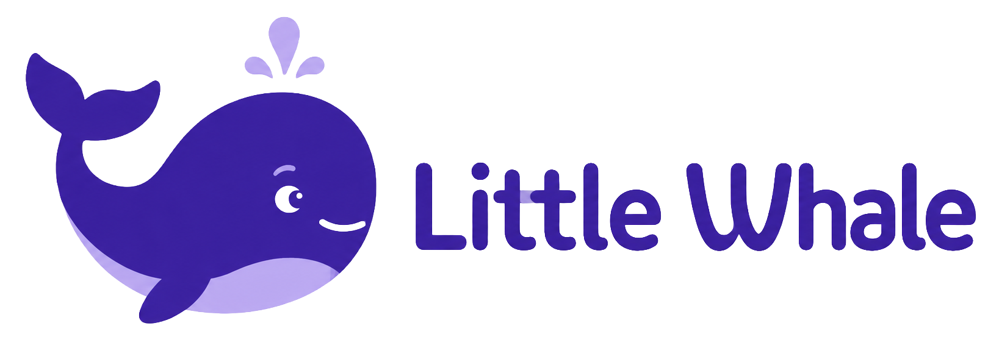

<p align="center">
  
</p>

<p align="center">
  <strong>An agentic coding assistant built for small, locally hosted language models.</strong>
</p>

<p align="center">
  <a href="LICENSE"></a>
  <a href="https://github.com/deepseek-ai/deepseek-harness"></a>
  
</p>

> [!IMPORTANT] Little Whale is an independent fork of [DeepSeek Harness](https://github.com/deepseek-ai/deepseek-harness). It is not an official DeepSeek product and is not affiliated with or endorsed by DeepSeek.

## Why Little Whale?

DeepSeek Harness is a powerful agentic development platform with a mature runtime, plugin architecture, web client, tool system, sessions, plans, and subagents. Its product defaults and onboarding, however, are primarily designed around frontier-class hosted models. Local providers are supported, but local execution is not the centre of the experience and requires comparatively manual configuration.

Little Whale takes that architecture in a more focused direction: a coding assistant designed specifically for **small local models** running on a workstation or a machine on the local network.

The project prioritises:

- A local provider as the normal first-run path, not an advanced option.
- Practical defaults for OpenAI-compatible local inference servers.
- Efficient prompts, context use, tool feedback, and agent behaviour for models with limited capacity.
- A complete coding-agent interface without requiring a cloud-model account.
- A stable path for adopting improvements from DeepSeek Harness without turning Little Whale back into the same product.

## Relationship with DeepSeek Harness

Little Whale is a real fork, not a wrapper and not a ground-up rewrite.

It preserves the parts of DeepSeek Harness that are already excellent and expensive to reproduce: the agent runtime, Cordis composition model, web conversation experience, tools, sessions, workspaces, plans, subagents, provider abstractions, and much of the underlying package ecosystem.

Little Whale adds its own product layer for local-model onboarding, defaults, branding, documentation, privacy choices, and model-specific behaviour. Upstream packages are tracked through explicit ownership boundaries so that compatible improvements can be imported as package snapshots rather than reconstructed manually.

### Plugin and extension compatibility

Compatibility with the DeepSeek Harness ecosystem is a design goal. Little Whale retains the Cordis plugin model and the relevant internal package contracts, including upstream identifiers such as `dsh`, `DSH_*`, and `@deepseek-ai/*` where changing them would break compatibility.

Plugins and extensions built against supported DeepSeek Harness interfaces should remain usable whenever Little Whale has not deliberately replaced that surface. Because the projects may evolve independently, compatibility is maintained as an engineering contract rather than promised blindly for every upstream version.

See [Upstream relationship and compatibility](UPSTREAM.md) for the exact boundary.

## Quick start

### Requirements

- Node.js 22.19 or later, or Node.js 24+
- pnpm 11.7+
- An OpenAI-compatible local model server

### Run from source

```sh
pnpm install
pnpm dev:web
```

On first launch, Little Whale starts with this editable local endpoint:

```text
http://127.0.0.1:1234/v1
```

This works naturally with local inference applications that expose an OpenAI-compatible API. The endpoint may also point to another machine on the LAN. Little Whale discovers the available models from the server; an API key is optional.

## Privacy defaults

Little Whale does not select a cloud model, contact an official DeepSeek service, enable DeepSeek web search, or send telemetry during normal startup. Provider traffic begins when a configured local or LAN model server is used.

## Documentation

| Document | Purpose |
|---|---|
| [Documentation map](docs/README.md) | Where product, contributor, architecture, and inherited reference documentation live |
| [Local providers](website/providers.md) | Configure a local OpenAI-compatible model server |
| [Architecture](website/architecture.md) | Little Whale's product layer and retained upstream architecture |
| [Development guide](docs/development.md) | Build, test, and contributor workflow |
| [Upstream relationship](UPSTREAM.md) | Fork rationale, compatibility policy, provenance, and update model |
| [Contributing](CONTRIBUTING.md) | How to report problems and participate |
| [Third-party notices](THIRD_PARTY_NOTICES.md) | Upstream components and their licences |

## Project status

Little Whale is under active development. The core web experience is usable, while local-model workflows, compatibility boundaries, and distribution packaging continue to evolve. Interfaces may change before the first stable release.

## Development commands

```sh
pnpm typecheck
pnpm lint
pnpm test:upstream
pnpm upstream:verify
pnpm build:web
pnpm docs:build
```

## Licence and attribution

Little Whale product code is distributed under **GPL-3.0-or-later**. Code retained from DeepSeek Harness remains subject to its original **MIT licence** and notices. The source boundary and complete attribution are documented in [UPSTREAM.md](UPSTREAM.md), [upstream/](upstream/), and [THIRD_PARTY_NOTICES.md](THIRD_PARTY_NOTICES.md).

Little Whale exists because DeepSeek Harness provided a strong open-source foundation. The fork acknowledges that work while pursuing a deliberately different product: serious agentic coding with models small enough to run locally.
